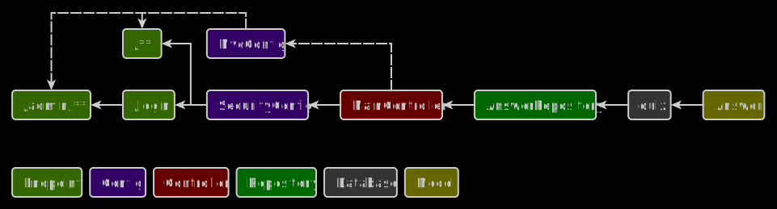

# Quiz

## Description
Conducting a quiz, issuing a list of answers in a readable form and exporting to CSV. Spring Security implements in
memory authorization to view poll results.

## Used tools
* Platform: Spring Boot 2.6.1
* Builder: Gradle
* Database: PostgreSQL 14
* Languages: Java 8 (SDK 1.8), HTML5, CSS3
* Dependencies: Spring Data JPA, Spring Security, Thymeleaf, Validation, Spring Web, OpenCSV, Lombok, PostgreSQL Driver

## Important files
* Builder configuration: /build.gradle
* Application properties: /src/main/resources/application.properties
* Security configuration: /src/main/java/web/quiz/config/SecurityConfig.java

## Frontend and backend schema

## Installation
1. Create quiz database in PostgreSQL
2. Run this project in development environment
3. Open http://localhost:8081 in browser

## Release notes
* Project type: Web application
* Date of release: 15 December 2021
* Date of last update: 13 February 2022
* Current version: 1.4
